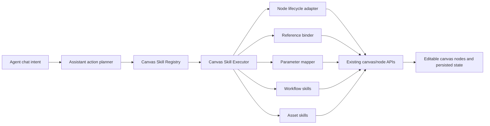

# Agent Canvas Skills Design

Date: 2026-06-06

## Confirmed Scope

Build an internal front-end Canvas Skills adapter layer for the Agent panel. The Agent must use this layer as its primary path when it creates, updates, references, generates, saves assets, or applies/saves workflows on the canvas.

The old action path does not need to be physically removed. It may remain as compatibility or fallback code, but Agent-created AI text, image, and video nodes must not bypass the existing user-equivalent node creation and submission flow.

This design intentionally does not add a backend HTTP API, does not simulate mouse clicks, does not auto-repair historical broken Agent nodes, and does not delete or overwrite existing asset-library content by default.

## Goals

- Make Agent canvas operations behavior-equivalent to normal user operations.
- Fix the current failure mode where an Agent image-generation request cannot generate and the created node cannot be edited because the input UI does not appear.
- Cover text, image, video, references, prompt presets, assets, and workflows in the first implementation phase.
- Keep nodes editable on the canvas after Agent operations: selected node, visible input box, visible controls, editable parameters, and retriable generation state.
- Persist an auditable `agent-canvas-skills` capability inventory covering parameters, permissions, confirmation rules, and failure behavior.

## Non-Goals

- Do not physically delete old `create_node`, `update_node_data`, or `queue_generation_task` compatibility logic.
- Do not expose the new skills through backend HTTP APIs in this phase.
- Do not automate real pointer or keyboard events as the normal execution path.
- Do not auto-repair old broken Agent-created nodes.
- Do not automatically add generated outputs to the asset library unless the user explicitly asks to save them.
- Do not directly write unknown advanced parameters into node data.

## User-Confirmed Decisions

- Skill shape: both internal and future user-visible skills are desired, but first build the internal Agent ability layer.
- First-phase breadth: cover text, image, video, assets, workflows, and references rather than only the image bug.
- API type: use front-end internal APIs first.
- Confirmation policy: keep existing plan/act rules.
  - Single text/image node generation or modification does not require confirmation in plan or act.
  - Video generation requires confirmation in plan mode and does not require confirmation in act mode.
  - Multi-node batch generation requires confirmation in plan mode and does not require confirmation in act mode.
  - Act mode has high canvas permissions and does not need confirmation cards.
- Node state after creation: the canvas node must look and behave like a user-created node, with editable input and controls.
- Old direct node-writing path: do not physically remove it, but do not use it as Agent main path.
- Parameters: use two layers. High-frequency parameters are explicit; advanced parameters use a validated `advancedOptions` object.
- References: `@` must be recorded in the Agent conversation and bound into the canvas node, with canvas binding as the source of truth.
- Assets/workflows:
  - Workflows are readable, applicable, saveable, and updateable.
  - Assets are readable, usable, and addable.
  - Existing assets are not deleted or rewritten by default.
  - Adding an asset requires explicit user intent such as "save to my assets".
- Defaults: use node defaults unless the user explicitly asks for a model, ratio, quality, quantity, or usage-driven override.
- Placement: place new nodes near selected nodes when possible; otherwise use the current viewport center; avoid overlaps.
- Create vs generate: "create/prepare" creates an editable draft; "generate" creates and submits generation.
- Failure behavior: preserve the node, show the failure state and reason, and let the user edit/retry.
- Technical equivalence: behavior equivalence through internal APIs, not pointer simulation.
- Skill architecture: expose intent-level skills to the Agent on top of node-level capability skills.
- Advanced options: whitelist known parameters; unknown parameters are not written and are surfaced in execution cards/logs.
- Generation timing: wait until the node is mounted and key UI/control state is ready before submitting generation.
- Skill inventory: create and maintain an `agent-canvas-skills` capability document.
- Required acceptance scenarios: image generation, text generation, video prep, workflow apply, `@` references, asset save, workflow save/update.

## Architecture

Add an internal Canvas Skills layer between Agent actions and the canvas runtime.

## Real-Code Review Adjustments

The code review on 2026-06-06 confirmed the product direction, but the implementation must fit the current front-end runtime instead of adding a new first-phase backend protocol.

- Phase 1 keeps the existing Assistant action protocol from the model/backend. The front-end executor converts old AI-node related actions into internal Canvas Skill calls. Do not add new backend `canvas_skill` action types as the phase-1 dependency.
- Canvas Skills require runtime adapters injected from `modules/app/appAssistantPanel.autoload.js`: graph store, workspace store, node creation flow, renderer bridge, workflow adapter, asset adapter, prompt preset adapter, model configuration, and context builders.
- AI node creation must use the existing user-equivalent creation path from `modules/app/canvasNodeFlows.js` (`createNodeAtCursor` or an equivalent exported helper), then select/focus the node and commit through the same store flow.
- Generation must wait for the mounted renderer instance from `window.__v2RendererBridge` and call the mounted node instance's existing generation method (`_onGenerate` or `onGenerate`). Canvas Skills must not duplicate image, text, or video generation logic.
- Reference binding must create real canvas bindings: edges plus prompt/ref-pill metadata where supported. Agent conversation mention memory is only a mirror; the canvas binding is the source of truth.
- Slash preset support should extract/export a non-UI helper from `modules/slashMenu.js`; do not simulate menu clicks.
- Confirmation policy for Canvas Skill operations must override the old generic risk model:
  - single text/image create, update, or generation: no confirmation in plan or act;
  - video generation: confirmation in plan, no confirmation in act;
  - multi-node generation with two or more generation nodes: confirmation in plan, no confirmation in act;
  - act mode: no confirmation cards for canvas execution.
- Asset operations must verify persistence through existing asset/store/upload APIs. Do not implicitly save, delete, overwrite, or directly mutate the asset store unless persistence has been confirmed.
- Mount/control readiness timeout keeps the draft node editable, does not submit generation, and returns a retryable operation card.
- Unknown advanced options are warnings only. They are never written into node data.

### New Modules

Suggested files:

- `modules/assistant/assistantCanvasSkillRegistry.js`
  - Registers all internal canvas skills.
  - Exposes intent-level and node-level skill descriptors.
  - Describes parameters, permission level, confirmation policy, and supported node types.
- `modules/assistant/assistantCanvasSkillExecutor.js`
  - Executes a validated skill call.
  - Applies permission and confirmation decisions.
  - Returns receipts, card payloads, warnings, and retry metadata.
- `modules/assistant/assistantCanvasNodeLifecycle.js`
  - Wraps user-equivalent node creation.
  - Waits for renderer mount and key node UI readiness before generation.
  - Selects/focuses created nodes.
- `modules/assistant/assistantCanvasReferenceBinder.js`
  - Converts `@` references into real canvas bindings.
  - Maintains conversation mention context as a mirror, not the source of truth.
- `modules/assistant/assistantCanvasParameterMapper.js`
  - Maps Agent parameters into existing node-supported fields.
  - Applies defaults from current node configuration.
  - Validates `advancedOptions` using per-node whitelists.
- `modules/assistant/assistantCanvasWorkflowSkills.js`
  - Applies existing workflows using normal workflow canvas logic.
  - Saves or updates current canvas/selection as workflows.
- `modules/assistant/assistantCanvasAssetSkills.js`
  - Reads, uses, and explicitly saves assets.
  - Does not delete or overwrite existing assets by default.

### Modified Modules

- `modules/assistant/assistantActionExecutor.js`
  - Convert Agent AI-node creation/update/generation actions into Canvas Skill calls.
  - Preserve old action support for compatibility, but remove it from the primary Agent AI-node path.
- `modules/app/appAssistantPanel.autoload.js`
  - Inject real canvas runtime dependencies into the Canvas Skills layer.
  - Provide graph store, workspace store, node creation flow, workflow operations, asset operations, model configuration, and context builders.
- `modules/app/appAssistantPanel.js`
  - Surface execution cards for canvas skill calls.
  - Keep normal chat output separate from operational cards.
- `docs/agent_canvas_skills.md`
  - Capability inventory for each skill.

## Skill Taxonomy

### Intent-Level Skills

These are the main skills the Agent should target from natural language:

- `canvas.intent.generateImage`
- `canvas.intent.generateText`
- `canvas.intent.prepareVideo`
- `canvas.intent.generateVideo`
- `canvas.intent.applyWorkflow`
- `canvas.intent.saveWorkflow`
- `canvas.intent.updateWorkflow`
- `canvas.intent.saveAsset`
- `canvas.intent.modifyNode`

### Node-Level Skills

These are lower-level APIs used by intent skills:

- `imageNode.createDraft`
- `imageNode.update`
- `imageNode.bindReferences`
- `imageNode.applyPreset`
- `imageNode.generate`
- `textNode.createDraft`
- `textNode.update`
- `textNode.bindReferences`
- `textNode.applyPreset`
- `textNode.generate`
- `videoNode.createDraft`
- `videoNode.update`
- `videoNode.bindReferences`
- `videoNode.applyPreset`
- `videoNode.generate`
- `workflow.apply`
- `workflow.save`
- `workflow.update`
- `asset.list`
- `asset.use`
- `asset.add`

## Data Flow

### Generate Image

1. Agent parses user message into `canvas.intent.generateImage`.
2. Resolve references from uploaded files, canvas nodes, and assets.
3. Resolve defaults from the image node's existing default configuration.
4. Create an image node through the normal canvas node creation flow.
5. Select/focus the node.
6. Wait for the renderer instance and key editable controls to be ready.
7. Apply prompt, model, ratio, quality, batch size, references, preset, and advanced options through supported node APIs.
8. If the user asked to generate, call the node's normal generation entrypoint.
9. Return a receipt and optional card metadata.
10. If generation fails, preserve the node and write the failure state/reason.

### Prepare Video vs Generate Video

- `canvas.intent.prepareVideo` creates and configures an editable video prep node without submitting generation.
- `canvas.intent.generateVideo` uses the same prep path, then submits generation only if the current mode and confirmation policy allow it.
- Plan mode requires a confirmation card before video generation.
- Act mode can submit video generation directly.

### Apply Workflow

1. Resolve workflow by existing workflow ID/name from workspace context.
2. Apply it using existing workflow canvas logic.
3. Remap node IDs through the normal workflow application logic.
4. Add nodes/edges through normal canvas mutation APIs.
5. Select the newly created workflow nodes.
6. Record usage metadata when the existing workflow logic supports it.

### Save or Update Workflow

1. Determine scope from current selection first, otherwise canvas-wide scope when explicitly requested.
2. Build workflow metadata: name, cover, tags, notes.
3. Use existing workflow save/update logic.
4. Require confirmation when overwriting/updating an existing workflow in plan mode.
5. Return a receipt after persistence succeeds.

### Save Asset

1. Execute only when the user explicitly asks to save to assets.
2. Resolve the source from a selected node, referenced node, generated output, or uploaded reference.
3. Validate `assetType`, name, and supported source media.
4. Add to asset library through existing asset APIs.
5. Do not delete or rewrite existing assets by default.

## Parameter Model

### Explicit High-Frequency Parameters

Image:

- `prompt`
- `modelId`
- `modelName`
- `provider`
- `aspectRatio`
- `imageSize`
- `quality`
- `batchSize`
- `references`
- `presetId`
- `generate`

Text:

- `prompt`
- `modelId`
- `modelName`
- `provider`
- `references`
- `presetId`
- `generate`

Video:

- `prompt`
- `modelId`
- `modelName`
- `provider`
- `references`
- `duration`
- `fps`
- `resolution`
- `generate`

Asset:

- `assetType`
- `sourceNodeId`
- `resultId`
- `name`
- `tags`

Workflow:

- `workflowId`
- `name`
- `scope`
- `selectedNodeIds`
- `cover`
- `tags`

### Defaults

When the user does not specify a value, use existing node defaults. The Agent may override only when the user explicitly states a value or a clear usage intent:

- "16:9", "9:16", "1:1" -> `aspectRatio`
- "高清", "4K", "2K" -> quality/image size where supported
- "三张", "4 张" -> `batchSize`
- Explicit model or provider name -> model fields
- "只准备节点" -> `generate=false`
- "生成" -> `generate=true`

### Advanced Options

Each node skill owns a whitelist of supported `advancedOptions` keys. Known keys are validated and mapped to existing node fields or APIs. Unknown keys are not written to node data. They appear as warnings in the execution card and diagnostic log.

This prevents Agent output from polluting canvas state with invented fields.

## References and Mentions

The `@` source order remains:

1. Uploaded reference content.
2. Canvas nodes.
3. My assets, grouped by role, scene, item, clothing, style, and custom.

When a reference is used:

- Conversation context records the mention for later Agent turns.
- Canvas binding creates the real node-level reference representation.
- Any required reference pill, edge, or binding metadata must be established through existing node reference behavior.
- Canvas binding is the source of truth if conversation memory and canvas state disagree.

## Confirmation and Permissions

Use the existing plan/act concept.

| Operation | Plan Mode | Act Mode |
| --- | --- | --- |
| Single text node create/update/generate | No confirmation | No confirmation |
| Single image node create/update/generate | No confirmation | No confirmation |
| Video prep node create/update | No confirmation | No confirmation |
| Video generation submit | Confirmation required | No confirmation |
| Multi-node batch generation | Confirmation required | No confirmation |
| Apply workflow | No confirmation unless risky overwrite is implied | No confirmation |
| Save new workflow | Confirmation recommended if broad canvas scope is inferred | No confirmation |
| Update existing workflow | Confirmation required | No confirmation |
| Add asset | Requires explicit user save intent | Requires explicit user save intent |
| Delete/overwrite assets | Out of scope by default | Out of scope by default |

## Error Handling

- Node creation failure: show an Agent card with the failure reason and do not claim creation succeeded.
- Mount readiness timeout: keep the draft node, mark it as not submitted, and show a retry card.
- Parameter validation failure: apply valid parameters only if safe; report invalid parameters in the execution card.
- Reference binding failure: keep the node editable; show which references were not bound.
- Generation failure: preserve the node, mark generation failed, store the error reason, and offer retry after edits.
- Workflow apply/save failure: no success receipt until the existing workflow API confirms success.
- Asset save failure: do not mark the asset as saved unless the asset API confirms persistence.

## Compatibility Strategy

Old actions remain for compatibility, but primary AI-node execution must route through Canvas Skills.

Compatibility mapping examples:

- Old `create_node` with `nodeType=ai-image` -> `imageNode.createDraft` plus optional update.
- Old `queue_generation_task` for `ai-image` -> `imageNode.generate` after lifecycle readiness.
- Old `run_prompt_preset_generation` -> node `applyPreset` then generation if allowed.
- Old `create_node` for generic non-generation nodes may remain on the old safe path until specific skills exist.

The executor should produce warnings when an old action is downgraded, skipped, or converted.

## Capability Inventory Document

Create `docs/agent_canvas_skills.md` with a table for every skill:

- Skill ID
- Description
- Parameters
- Required context
- Node/workspace dependencies
- Confirmation policy
- Failure behavior
- Supported references
- Supported advanced options
- Test coverage

This document is for maintenance and future user-visible skill exposure.

## Testing Plan

Unit tests:

- Skill registry exposes the expected skills.
- Parameter mapper applies defaults and rejects unknown advanced options.
- Reference binder resolves uploaded references, canvas nodes, and assets.
- Confirmation policy matches plan/act rules.
- Old AI-node actions are converted to skill calls.
- Unknown advanced options are not written to node data.

Integration tests:

- Agent image generation creates an editable image node, waits for readiness, and submits generation.
- Agent text generation creates an editable text node and submits generation.
- Agent video prep creates an editable video node without generation.
- Plan-mode video generation returns a confirmation card before submitting.
- Act-mode video generation submits without confirmation.
- Workflow application creates normal nodes and edges and selects them.
- Workflow save/update persists only after existing workflow APIs confirm success.
- Asset save requires explicit user intent and persists through asset APIs.
- Generation failure preserves node state and returns a retryable card.

Manual/browser verification:

- Image node created by Agent shows the same input box and controls as a user-created image node.
- Text node created by Agent shows the same editing behavior as a user-created text node.
- Video node created by Agent shows editable prompt/reference controls.
- `@` references appear in the node UI and remain available in Agent follow-up context.
- `/` preset usage runs through existing preset behavior, not pasted prompt text.

## Acceptance Scenarios

- Agent input: "生成一张赛博猫 16:9 高清图". Expected: editable image node appears, image generation starts, node keeps controls visible.
- Agent input: "用 @角色A 生成 3 张头像". Expected: role asset is bound to the image node, `batchSize=3`, generation starts.
- Agent input: "/某个已有预设 生成一段宣传文案". Expected: editable text node uses the existing preset and generates text.
- Agent input: "准备一个视频节点，不生成". Expected: editable video prep node appears and no video generation starts.
- In plan mode, Agent input: "生成视频". Expected: confirmation card appears before video generation.
- In act mode, Agent input: "生成视频". Expected: video generation submits without confirmation.
- Agent input: "把这张结果保存到我的资产". Expected: asset library adds the asset after persistence succeeds.
- Agent input: "套用某个工作流". Expected: existing workflow apply logic creates nodes and edges and selects them.
- Agent input: "保存当前选区为工作流". Expected: workflow is saved with selected nodes after persistence succeeds.
- Simulated generation failure. Expected: node remains editable and shows failed status; Agent card reports the reason.

## Open Implementation Notes

- The implementation should first audit the existing image, text, and video node creation/generation entrypoints because some files are minified or wrapper-based.
- If a node has no stable internal generation entrypoint, add a small explicit adapter around the existing node method instead of simulating clicks.
- Readiness checks should avoid long blocking. They should time out with a retryable failure card.
- The new layer should be small and testable. It should not become a second implementation of image/text/video generation.
- The source of truth for model options remains the existing model registry and node model configuration.
