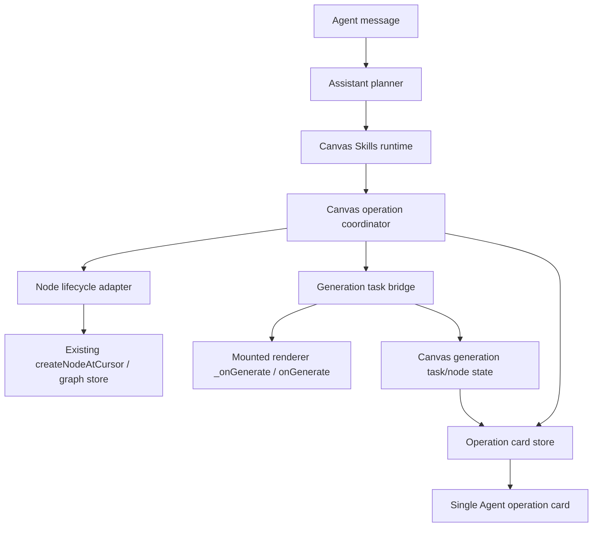

# Agent Panel Generation Sync Design

Date: 2026-06-06

## Confirmed Scope

This design covers the next Agent panel optimization pass after the Canvas Skills base module. The goal is to make Agent-driven canvas generation behave the same as manual canvas generation, while keeping the Agent chat clean, understandable, and synchronized with canvas state.

The work is design-only at this stage. Implementation code starts only after this spec is reviewed and approved.

## User-Confirmed Decisions

- Delivery boundary: write this design document first, then create an implementation plan after confirmation.
- Generation behavior:
  - Image and text generation from the Agent must create the node and submit generation automatically.
  - Video generation follows existing plan/act rules: plan mode requires confirmation, act mode submits directly.
  - Single image/text node generation does not require confirmation in plan or act mode.
  - Multi-node generation requires confirmation in plan mode and does not require confirmation in act mode.
  - Act mode gives the Agent high canvas permissions and does not show confirmation cards.
- Canvas state is the source of truth:
  - If the canvas node is queued, running, completed, failed, paused, retried, or cancelled, the Agent card must show the same state.
  - Agent receipts must not claim success only because a draft node was created.
- One assistant reply can show at most one operation card:
  - The card can contain one node, multiple nodes, or one workflow.
  - Raw technical JSON cards such as standalone `imageNode.createDraft` cards must not appear as separate chat cards.
  - User-facing node/workflow details are expanded by default.
  - Technical execution details are collapsed by default.
- Card language:
  - Main status uses user language: preparing, generating, completed, failed, retryable.
  - Expanded technical details may show concise machine status: `submitted`, `queued`, `running`, `completed`, `failed`.
- Renderer readiness:
  - If a node draft is created before its renderer is mounted, generation must remain pending and auto-submit when the renderer becomes ready.
  - A readiness timeout becomes retryable; it must not silently mark the operation completed.
- Attachment references:
  - Uploaded references automatically join the current Agent request context and are bound to generation when relevant.
  - Thumbnails appear at the top of the input component.
  - The text input shifts down below the thumbnails.
  - Each thumbnail has a small X to remove it.
  - Clicking a thumbnail opens a larger preview.
- Streaming/typewriter:
  - Prefer true backend streaming deltas.
  - If the backend returns a whole answer at once, the frontend must still render it with a typewriter fallback.
- Text node editability:
  - Agent-created text nodes use the same node type and data shape as manual text nodes.
  - During generation, the text node is temporarily locked.
  - After generation completes or fails, the text node becomes editable like a normal text node.
- Skills loading:
  - Canvas Skills are the Agent's default base capability and load automatically.
  - There is no user switch for the base Skills module.
  - On success, no persistent `Skills AUTO` badge is needed.
  - On failure or degraded mode, show only a transient warning notice.

## Current Problems Observed

- Agent requests can add a node but do not reliably submit generation, or submit without making the canvas node show the real generating state.
- The node UI does not consistently show manual-equivalent generation state: animation, locked input, and a pause/stop control.
- The Agent card can say the operation completed even when the renderer never started generation.
- Skill trace cards are currently appended as separate technical cards, which creates noisy chat output and exposes implementation detail.
- Uploaded reference thumbnails are not shown in the intended input area.
- Streaming still feels like one-shot output when the backend sends a final complete message.
- Agent-created text nodes can be non-editable because they do not fully match the normal user-created text node lifecycle.

## Design Recommendation

Use a canvas-first state synchronization design.

The Agent should still plan and call Canvas Skills, but the success state must come from the same canvas node/task state that manual generation uses. The Agent should create drafts through existing node flows, submit through the mounted node renderer, and subscribe to node/task state changes. The chat card becomes a view of canvas operations, not the authority that decides whether generation succeeded.

This is the recommended approach because it fixes the root mismatch: the Agent currently treats action execution receipts as final truth, while the canvas has its own real generation lifecycle.

## Considered Approaches

### Approach A: Patch receipts only

Keep the current executor mostly unchanged and adjust receipt text/cards to be less misleading.

- Pros: fastest and lowest code churn.
- Cons: does not guarantee real generation submission, does not fix canvas/card drift, and cannot reliably sync manual pause/retry/cancel actions.
- Decision: rejected as too shallow.

### Approach B: Canvas-first task bridge

Add a small bridge between Canvas Skills execution, canvas node lifecycle, and Agent cards. Draft creation, renderer readiness, generation submission, node locking, retry, and card status all flow through the bridge.

- Pros: fixes root cause, keeps existing node behavior, avoids building a parallel generation system, gives clean card synchronization.
- Cons: needs careful adapter boundaries and tests around renderer readiness and state mapping.
- Decision: recommended.

### Approach C: Rebuild Agent generation as a separate API path

Let the Agent call generation APIs directly, then write results back to nodes.

- Pros: can be backend-friendly in the future.
- Cons: bypasses current node UI, risks different behavior from manual canvas generation, and repeats logic already embedded in node renderers.
- Decision: rejected for this phase.

## Architecture



### Main modules

- `modules/assistant/canvasSkills/adapters/nodeLifecycleAdapter.js`
  - Keep draft creation on the existing canvas node path.
  - Change generation behavior from timeout-to-retryable-only into pending-then-auto-submit.
- `modules/assistant/canvasSkills/generationTaskBridge.js`
  - New focused module.
  - Owns pending generation submissions, renderer readiness polling/listening, submission attempts, retry state, and mapping canvas state into operation state.
- `modules/assistant/assistantCanvasSkillExecutor.js`
  - Continue converting Agent actions into Canvas Skill calls.
  - Stop treating draft creation or queued receipt as final generation success.
  - Return operation metadata that the card can subscribe to.
- `modules/app/appAssistantPanel.js`
  - Render one operation card per assistant reply.
  - Fold skill traces into the card's collapsed technical details.
  - Apply typewriter fallback in both stream and non-stream paths.
  - Render reference thumbnail bar inside the input composer.
- `modules/assistant/assistantGenerationTaskStore.js`
  - Reuse or extend as the normalized store for canvas-driven operation state.
  - It should represent `queued`, `submitting`, `running`, `completed`, `failed`, `cancelled`, and `retryable`.


## Real-Code Review Adjustments

The review against the current source code on 2026-06-06 confirms the design direction and adds these implementation constraints.

### Hard constraints from current code

- `modules/app/appAssistantPanel.js` currently marks the latest interaction card as `completed` immediately after `executeActions()` returns. This must change. The card must move to `preparing` or `generating` when generation is submitted or pending, and only move to `completed` when canvas node/task state confirms completion.
- `modules/app/appAssistantPanel.js` currently appends `result.skillTraceCards` as independent message cards. This must stop. Trace data may still be produced for diagnostics, but the Agent panel must fold it into one operation card under collapsed `executionDetails`.
- `modules/assistant/canvasSkills/adapters/nodeLifecycleAdapter.js` currently turns renderer readiness timeout into `generationStatus: "retryable"` immediately. This is too early for normal canvas mounting. The implementation must register a pending generation submission, auto-submit after mount, and only become retryable after the pending submission times out or submit fails.
- `modules/app/appAssistantPanel.js` stream handling currently inserts a final `message.done` reply directly when no deltas were shown. The stream path must use the same typewriter helper as the non-stream path for final-only replies and split unusually large deltas.
- `modules/app/appAssistantPanel.js` currently renders attachments as removable text chips. It must render thumbnail tiles with a separate X button and preview behavior.
- `modules/app/appAssistantPanel.js` still renders the persistent `AUTO` badge. Successful Canvas Skills autoload must be silent; only degraded load shows a transient notice.
- `modules/assistant/assistantGenerationTaskStore.js` currently lacks `pendingRenderer`, `submitting`, `retryable`, and `paused` states. Either extend it or add a small bridge store that maps these states before the Agent card reads them.

### Required implementation rule

The implementation must not treat Canvas Skills executor receipts as final generation truth. Receipts can describe what was requested or submitted. Final state must come from canvas node/task state through a centralized state mapper.

### Second deep-review corrections

The 2026-06-06 source review found additional constraints that are required before this work can be accepted:

- The generation bridge is a trigger/synchronization adapter, not the owner of final node state. It may mark `pendingRenderer`, `submitting`, or pre-submit `running`, but after the real renderer method starts it must not overwrite the renderer's own `success`, `failed`, `cancelled`, `generationStartTime`, `generationDuration`, or stop-button state.
- Renderer submission must prefer an explicit manual-equivalent adapter when available, such as `submitGenerationFromAgent`, before falling back to private renderer methods like `_onGenerate` or `onGenerate`.
- Node status patching must respect the node's actual data shape. Nodes that store fields flat on the node object must not receive a misleading nested `node.data` object; nodes that already use `node.data` must keep that shape.
- Status mapping must evaluate all known status fields together. Terminal provider fields such as `jobStatus: "success"` or `asyncTaskStatus: "failed"` must win over stale `generationStatus: "running"` and stale `isGenerating: true`.
- Immediately after the user submits a chat message, the Agent reply area must show a waiting placeholder such as `思考中...`. The first stream delta or final reply must reuse and replace that placeholder instead of creating a second assistant reply.
- Generation lifecycle text must be card-scoped. The bottom receipt area is only for errors, configuration blockers, and degraded warnings; it must not show generation progress for successful image/text/video submissions.
- Browser smoke acceptance must inspect the live node UI, not only debug fixtures: the generated node should expose the manual-equivalent stop/pause button state, a generation timer source such as `generationStartTime`, and a locked input while running.

### Required test updates

Existing tests that assert separate `skillTraceCards`, persistent `AUTO`, or immediate `completed` cards must be updated to the new product behavior. Do not preserve old assertions just to keep tests green.

## Data Flow: Agent Image/Text Generation

1. User submits a prompt in the Agent panel.
2. Attachments and `@` mentions are resolved into request context.
3. Assistant response proposes generation actions.
4. Canvas Skills executor creates an editable draft node through the existing node flow.
5. The coordinator registers an operation card item linked to `conversationId`, `messageId`, `operationId`, and `nodeId`.
6. The generation task bridge checks renderer readiness.
7. If ready, it calls the same renderer generation method manual generation uses.
8. If not ready, it records `queued/pendingRenderer` and auto-submits once the renderer mounts.
9. Canvas node state updates to real generating UI state: animation, locked input, pause/stop control, and task metadata.
10. The Agent card subscribes to that node/task state and updates in sync.
11. On completion or failure, the node unlocks for editing, and the card shows completed or failed/retryable state.

## Pending Renderer Submission

A draft node can exist before the renderer is ready. This is normal in a canvas UI, so it must not be treated as failure immediately.

Behavior:

- Register pending submission with `nodeId`, `operationId`, `prompt`, `nodeType`, and generation parameters.
- Mark node data with a non-final queued/submitting state that existing node UI can display.
- Poll or listen for renderer bridge mount readiness.
- Submit exactly once when ready.
- If the node is deleted before readiness, mark the operation cancelled/failed with a clear reason.
- If readiness times out, keep the node editable and show retryable status in both node and card.
- Retry from the card and retry from the canvas node call the same bridge retry function.

## State Mapping

Canvas node/task state is mapped to Agent card state:

| Canvas/task state | Agent card state | User meaning |
| --- | --- | --- |
| `pendingRenderer`, `queued`, `submitted` | preparing | Node exists and is waiting to start |
| `running`, `generating`, `processing` | generating | Generation is in progress |
| `completed`, `succeeded`, `success` | completed | Output is ready |
| `failed`, `error` | failed | Generation failed |
| `retryable` | retryable | User can retry |
| `cancelled`, `paused`, `stopped` | cancelled/paused | User stopped or paused generation |

The mapping must be centralized so cards, debug snapshots, tests, and future UI labels do not drift.

## Single Operation Card

Each assistant reply owns only one visible operation card.

Card structure:

```text
[Card title]
将生成 1 个图片节点

[Visible details, expanded by default]
- Node: Image / node name / prompt preview
- Model: configured display name
- References: 2 uploaded references
- Count: 4
- Current status: generating

[Actions]
- Retry, pause, cancel, or confirm when applicable

[Execution details, collapsed]
- Skills: imageNode.createDraft, imageNode.generate
- Technical status: submitted -> running
- Warnings/errors: concise and redacted
```

Rules:

- No separate `skill_trace` card should be appended to the message.
- Existing trace data should be moved into `executionDetails` on the single card.
- If a reply creates multiple nodes or applies a workflow, the same card groups details by image/text/video/workflow.
- If plan mode requires confirmation, the same card expands confirmation controls with Confirm and Cancel.

## Confirmation Rules

| Operation | Plan mode | Act mode |
| --- | --- | --- |
| Single image create/update/generate | No confirmation | No confirmation |
| Single text create/update/generate | No confirmation | No confirmation |
| Video create/update without generation | No confirmation | No confirmation |
| Video generation submit | Confirm first | No confirmation |
| Multi-node generation | Confirm first | No confirmation |
| Workflow apply | No confirmation unless destructive/risky | No confirmation |
| Asset add | Requires explicit save intent | Requires explicit save intent |

A confirmation card is still the same single operation card; it is not an extra system prompt.

## Reference Thumbnail Bar

The input composer should have this layout:

```text
+------------------------------------------------+
| [ref1 thumb x] [ref2 thumb x] [ref3 thumb x]   |  <- only visible when references exist
+------------------------------------------------+
| Type a message...                         [@]  |
|                                      [Send]    |
+------------------------------------------------+
```

Behavior:

- Uploaded reference thumbnails render above the text input inside the composer.
- The composer height grows and the text input starts below thumbnails.
- X removes the reference from the current pending message context.
- Clicking a thumbnail opens a larger preview overlay.
- Removed references are not sent in the next request.
- Sent references are recorded in the conversation context and bound to generated nodes when relevant.

## Streaming and Typewriter Fallback

The ideal path is true streaming from the backend. The frontend should consume deltas and render them immediately.

Fallback rules:

- If the stream path receives no deltas and then gets a final complete reply, render the final reply through `appendAssistantTypingMessage` instead of inserting it at once.
- If a single delta is unusually large, split it into typewriter chunks before display.
- Non-stream responses continue to use the existing typing helper.
- Operation card updates are separate from text typing so generation status can update while text is still typing.

## Text Node Editability

Agent-created text nodes must be indistinguishable from manual text nodes.

Implementation rules:

- Use the same text node type and creation helper as manual creation.
- Do not write invented fields that bypass renderer expectations.
- During generation, set the same lock/running fields manual generation uses.
- On completed, failed, retryable, or cancelled state, release the edit lock.
- Clicking a completed or failed Agent-created text node must show the normal editor/input UI.

## Skills Default Loading

Canvas Skills remain the Agent's default base skills.

Behavior:

- Runtime loads automatically through the Agent panel autoload path.
- Successful load is silent; no persistent `AUTO` badge is shown.
- Failed/degraded load shows a transient warning and keeps chat available.
- Debug snapshot still exposes skills readiness for diagnostics.

## Error Handling

- Node creation failure: no success card; show failed operation with reason.
- Renderer unavailable: show preparing, then retryable after timeout.
- Submit failure: node stays editable and card shows failed/retryable.
- Provider/model failure: show failed with safe category, not secrets or raw provider payloads.
- Attachment preview failure: keep file in context if possible and show placeholder thumbnail.
- Reference binding failure: generation can proceed only if references are optional; otherwise show failed/retryable with clear missing reference.
- User deletes node during generation: operation becomes cancelled or failed due to missing node.

## Testing Plan

### Unit tests

- Generation task bridge queues pending renderer submissions and submits once mounted.
- Timeout produces retryable state, not completed state.
- State mapper converts canvas states to card states consistently.
- Skill traces are folded into one card's execution details.
- Stream final-only response uses typewriter fallback.
- Large stream delta is chunked for typewriter display.
- Attachment thumbnail remove updates pending references.
- Text node unlocks after completed/failed/retryable states.

### Integration tests

- Agent image request creates a node and starts real manual-equivalent generation state.
- Agent text request creates a node, starts generation, locks while running, and becomes editable after completion/failure.
- Renderer-not-ready scenario queues then auto-submits after mount.
- Agent card follows canvas state through queued, running, completed, failed, retryable, and cancel/retry.
- One assistant reply never renders more than one operation card.
- Plan-mode video generation and multi-node generation show confirmation inside the single card.
- Act-mode generation executes without confirmation cards.
- Uploaded references show thumbnails, can be removed, previewed, sent, and bound to generated nodes.

### Manual/browser checks

- Generate image from Agent and confirm node animation/input lock/pause button match manual generation.
- Pause or retry from canvas and confirm Agent card updates.
- Retry from Agent card and confirm the canvas node uses the same retry path.
- Upload two references and confirm thumbnails appear in the red-marked input region.
- Confirm chat text appears as typewriter even when backend sends a complete answer at once.
- Confirm no raw `imageNode.createDraft` JSON card appears.

## Acceptance Criteria

- Agent image/text generation creates a normal editable node and submits generation automatically.
- The canvas node visibly enters generating state: animation, locked input, and pause/stop control.
- Agent card status matches canvas state for preparing, generating, completed, failed, retryable, cancelled, and paused.
- A single assistant reply contains at most one operation card.
- Operation card shows user-facing details by default and technical details only when expanded.
- Uploaded references appear as removable, previewable thumbnails above the input text area.
- References used in the prompt are attached to the request context and bound to generated nodes.
- Assistant text output uses typewriter behavior for true streams, final-only streams, and non-stream responses.
- Agent-created text nodes are editable after generation completes or fails.
- Canvas Skills load by default, with only transient degraded notices on failure.

## Implementation Boundaries

- Do not build a separate generation backend path in this phase.
- Do not simulate mouse clicks as the normal solution.
- Do not expose raw JSON skill traces in chat.
- Do not claim completion from executor receipts alone.
- Do not auto-save generated outputs to assets unless the user explicitly asks.
- Do not delete old compatibility paths unless a later cleanup task explicitly targets them.

## Open Risks

- Some node renderers may not expose a stable generation method beyond `_onGenerate` or `onGenerate`; if so, add a thin explicit adapter around the existing renderer behavior.
- Canvas state field names may differ by node type; central mapping and tests are required.
- Real provider APIs may accept submission but fail asynchronously later; the card must keep listening after submit.
- Streaming behavior depends on backend event shape; the frontend fallback is required even after backend streaming is improved.

