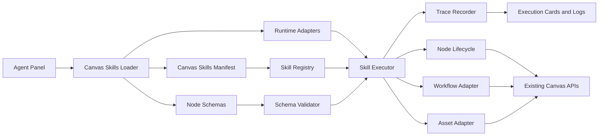

# Canvas Skills Optimization Design

Date: 2026-06-06

## Purpose

This design upgrades Canvas Skills from a set of internal assistant helpers into a more independent, loadable Canvas Skills module for the Agent panel. The goal is to make the Agent use canvas capabilities more accurately, efficiently, safely, and completely.

The work covers four product improvements in one major version:

1. Real API smoke test for text + image generation submission.
2. Complete node parameter schemas for image, text, and video nodes.
3. User-visible Skills execution detail cards.
4. Enhanced asset library support for `@ 我的资产`.

The module remains inside the current project for packaging and release simplicity, but its boundaries should be close to a plugin package: manifest, schemas, loader, runtime, adapters, tracing, assets, tests, and documentation.

## Confirmed Decisions

- Release shape: one major version, implemented through internal checkpoints.
- Real API smoke scope: text model + image generation submission.
- Real API smoke success rule: image generation task submitted successfully; final image result is not required.
- Real API smoke entrypoints: standalone script and optional R5 integration.
- Real API credentials: read only from the existing project/application configuration; do not add new API key inputs to smoke scripts.
- Real API failure behavior: standalone smoke fails strictly; R5 integration is soft by default and strict only with an explicit fail flag.
- Real API execution layers: module-level smoke by default and browser-level smoke for acceptance/release checks.
- Node schema audience: serve Agent first, but keep schema reusable by UI later.
- Node schema strictness: use layered schema states: `supported`, `planned`, `deprecated`, and `internal`.
- Node schema maintenance: mix automatic extraction of currently supported fields with manually curated planned fields.
- Skills execution card detail: default simple summary, expandable technical details.
- Skills execution card placement: per-reply summary card plus an optional full history/debug log.
- Prompt display in execution cards: truncated summary by default; expanded prompt content is still redacted.
- Asset categories: default six categories, expandable later.
- Asset search: enhanced search in this version, semantic search fields reserved for later.
- Asset batch import: support canvas-result batch save first, and local multi-file import as a second path.
- Asset deduplication: lightweight dedupe now, hash/perceptual-hash fields reserved for later.
- Skills load failure: Agent panel keeps chat available but disables canvas operations with a clear notice.
- Independent module location: `modules/assistant/canvasSkills/`.

## Non-Goals

- Do not require real video generation in this version's smoke test.
- Do not require waiting for final generated image pixels in default smoke checks.
- Do not introduce new API key CLI parameters for smoke tests.
- Do not make semantic/vector asset search a hard dependency in this version.
- Do not let the Agent write `planned`, `unknown`, secret, or internal fields into node data.
- Do not remove existing compatibility files immediately; they can re-export or delegate to the new module.

## Target Module Structure

```text
modules/assistant/canvasSkills/
  index.js
  manifest.js
  loader.js
  registry.js
  executor.js
  runtime.js

  schemas/
    index.js
    imageNode.schema.js
    textNode.schema.js
    videoNode.schema.js
    workflow.schema.js
    asset.schema.js
    schemaValidator.js
    schemaIntrospection.js

  adapters/
    nodeLifecycleAdapter.js
    rendererBridgeAdapter.js
    workflowAdapter.js
    assetStoreAdapter.js
    promptPresetAdapter.js
    modelRegistryAdapter.js

  tracing/
    skillTraceRecorder.js
    skillTraceRedactor.js
    skillTraceCards.js

  assets/
    assetCatalog.js
    assetSearchIndex.js
    assetImportService.js
    assetDuplicateDetector.js
    assetReferenceHealth.js

  smoke/
    realApiSmokeRunner.js
    realApiSmokeFixtures.js
    realApiSmokeReporter.js

  docs/
    README.md
    manifest.contract.md
    schema.contract.md
    smoke-test.contract.md
```

Existing files such as `modules/assistant/assistantCanvasSkillExecutor.js` may remain as compatibility layers and delegate to the new implementation.

## Architecture



The Agent should ask the registry and schema layer what it can do, then call the executor. The executor should use existing canvas/node/workflow/asset APIs instead of bare node writes. Tracing wraps the execution path so users can see what happened.

## Loading And Degradation

### Successful Load

When `canvasSkills/loader.js` succeeds:

- The Agent can chat.
- The Agent can create, update, reference, and generate canvas nodes through Skills.
- The Agent can use schemas to validate parameters.
- The Agent can read/use/add assets through the asset adapter.
- The Agent can apply/save/update workflows through the workflow adapter.
- The Agent panel can render execution detail cards.

### Failed Load

When the module fails to load:

- The Agent chat remains available.
- Canvas operations are disabled.
- The panel shows a clear notice: `画布 Skills 未加载，当前只能聊天，不能操作画布。`
- The Agent must not claim it created, changed, or generated canvas content.
- The failure should be visible in debug snapshot and test artifacts without leaking secrets.

## Real API Smoke Test

### Scope

The real API smoke test verifies that the live configured application can:

1. Find a configured text model.
2. Find a configured image model/provider.
3. Send a real Agent request through the text model.
4. Produce or accept a real image-generation intent/action.
5. Create an editable image node through Canvas Skills.
6. Submit the image generation task successfully.

Final image output is not required for the default pass condition.

### Early Baseline Smoke

Because real API validation is the highest-risk dependency, add an early baseline smoke before the large module migration is complete:

1. Use the existing Agent panel/runtime path and current project configuration.
2. Verify text-model connectivity and image-generation submission with the smallest possible prompt.
3. Save a redacted artifact under `output/regression/real-api-smoke/early-baseline/`.
4. Treat this early baseline as an implementation checkpoint before broad refactors continue.

The later module-level and browser-level smoke runners still remain required after `canvasSkills` is introduced. The early baseline is a risk detector, not a substitute for the final smoke suite.

### Configuration And Model Selection

Real API smoke must read only existing application configuration. It must not accept raw API keys from CLI parameters.

Configuration sources:

- Browser mode uses the same application config path as the live Agent panel.
- Module mode must use the same config snapshots/adapters used by the application, such as the API config snapshot/server config loader and model-registry helpers, so module smoke cannot accidentally pass with a different config than the UI.
- Artifacts may record model/provider display names and ids after redaction, but never raw key/token/header values.

Text model selection:

1. Prefer the first configured text-node model from the model registry.
2. The selected text model must satisfy the same Agent panel model contract: configured, text-capable, and not image/video/tool generation capable.
3. If no valid text model exists, fail with `CONFIG_MISSING_TEXT_MODEL`.

Image model selection:

1. Prefer the first configured image-node model from the existing image model registry/catalog.
2. The selected image model must be usable by the current image node generation flow.
3. If no valid image model exists, fail with `CONFIG_MISSING_IMAGE_MODEL`.

### Submission Success Contract

Default smoke success means the image generation request was accepted for processing. Any one of these is enough:

- a provider task id is returned or stored, such as `taskId`, `jobId`, `requestId`, `rhTaskId`, `dreaminaSubmitId`, or `asyncTaskId`;
- the created image node enters `submitted`, `queued`, `running`, or `generating` state;
- the Canvas Skills execution receipt reports a queued/submitted generation node id.

For Browser mode, the accepted evidence may come from `debugSnapshot().assistant.lastReceiptDetails.queuedGenerationNodeIds` or `startedGenerationNodeIds` when paired with a completed stream and a `skill_trace` card; this covers the live UI timing window where the receipt is visible before the graph snapshot exposes the submitted node state.

Default timeout should be explicit and configurable, with a recommended default of 90 seconds. Waiting for final image pixels is not required unless a future opt-in flag is added.

Failure categories must be normalized in artifacts:

- `CONFIG_MISSING_TEXT_MODEL`
- `CONFIG_MISSING_IMAGE_MODEL`
- `AUTH_FAILED`
- `QUOTA_EXHAUSTED`
- `PROVIDER_REJECTED`
- `NODE_CREATE_FAILED`
- `GENERATION_SUBMIT_FAILED`
- `TIMEOUT`
- `SECRET_SCAN_FAILED`
- `UNKNOWN`

### Standalone Entrypoint

Add:

```text
tools/run_canvas_agent_real_api_smoke.ps1
tools/assistant_real_api_smoke.mjs
```

Supported modes:

```powershell
powershell -ExecutionPolicy Bypass -File tools\run_canvas_agent_real_api_smoke.ps1 -Mode Module
powershell -ExecutionPolicy Bypass -File tools\run_canvas_agent_real_api_smoke.ps1 -Mode Browser
powershell -ExecutionPolicy Bypass -File tools\run_canvas_agent_real_api_smoke.ps1 -Mode All
```

Default mode should be `Module`.

### R5 Integration

Extend `tools/run_canvas_agent_r5_regression.ps1` with:

```powershell
-RealApiSmoke
-RealApiSmokeMode Module|Browser|All
-FailOnSmokeFailure
```

Behavior:

- Standalone smoke: strict failure, exit non-zero.
- R5 smoke without `-FailOnSmokeFailure`: soft failure, report only.
- R5 smoke with `-FailOnSmokeFailure`: strict failure.

### Artifact Requirements

Smoke artifacts should be written under:

```text
output/regression/real-api-smoke/
```

They should include:

- redacted text model identity;
- redacted image model/provider identity;
- created node id;
- generation submission status;
- warnings and retry metadata;
- browser screenshots for browser mode;
- sanitized request/response summaries;
- secret scan result.

Artifacts must not include API keys, tokens, Authorization headers, long base64 payloads, or secret-shaped strings.

### Secret Scan Gate

Real API smoke must run a scoped secret scan over:

- `output/regression/real-api-smoke/`;
- the R5 artifact set when smoke is run through R5;
- any execution-trace artifact exported by the Agent panel.

The scan must fail on raw API keys, `Authorization`, `Bearer`, token/password/credential fields, signed URL query strings, long base64 payloads, and OpenAI-style secret prefixes. The existing R5 scoped scan can remain, but real smoke must add its own artifact-specific scan and report `TOTAL 0` or equivalent structured success.

## Node Parameter Schema

### Schema States

Each field must have one of these states:

- `supported`: safe for Agent to write today.
- `planned`: known product requirement but not safe to write yet.
- `deprecated`: readable for compatibility, but Agent should not generate it for new actions.
- `internal`: implementation field, not Agent-writable.

Agent behavior:

- Use only `supported` fields for automatic execution.
- Mention `planned` fields as recognized but not yet executable.
- Preserve existing warning behavior for unknown fields.
- Never write unknown/planned/internal fields into node data.

### Field Contract

Each field should use a stable contract like:

```js
{
  key: "batchSize",
  label: "生成数量",
  type: "number",
  status: "supported",
  nodeTypes: ["ai-image"],
  min: 1,
  max: 8,
  defaultValue: 1,
  aliases: ["count", "numberOfImages", "生成张数"],
  mapsTo: "data.batchSize",
  agentWritable: true,
  uiReusable: true,
  redaction: "none",
  description: "一次提交生成的图片数量"
}
```

### Image Node Supported Fields

Minimum supported fields:

- `prompt`
- `modelId`
- `provider`
- `aspectRatio`
- `imageSize`
- `quality`
- `batchSize`
- `references`
- `presetId`
- `presetName`
- `template`
- `inputs`

Planned fields:

- `negativePrompt`
- `seed`
- `steps`
- `guidanceScale`
- `sampler`
- `style`
- `lora`
- `controlNet`
- `referenceWeights`
- `background`
- `safetyLevel`

### Text Node Supported Fields

Minimum supported fields:

- `prompt`
- `modelId`
- `provider`
- `references`
- `presetId`
- `presetName`
- `template`
- `inputs`

Planned fields:

- `temperature`
- `topP`
- `maxTokens`
- `systemPrompt`
- `responseFormat`
- `tools`
- `memoryPolicy`

### Video Node Supported Fields

Minimum supported fields:

- `prompt`
- `modelId`
- `provider`
- `duration`
- `fps`
- `resolution`
- `references`
- `presetId`
- `presetName`
- `template`
- `inputs`

Planned fields:

- `cameraMotion`
- `motionStrength`
- `firstFrame`
- `lastFrame`
- `negativePrompt`
- `seed`
- `aspectRatio`
- `style`
- `audio`
- `loop`
- `transition`

### Schema Maintenance

- Use current parameter mapper, node configuration, and tests to seed `supported` fields.
- Manually curate `planned` fields from product requirements.
- Add tests that fail if schema and mapper behavior diverge.
- Keep schema reusable by future UI controls.

## Skills Execution Detail Cards

### User Experience

Each assistant response that performs canvas work can include a compact card under the message:

```text
已完成 3 个画布操作：
- 创建图片节点
- 绑定 2 个参考素材
- 已提交图片生成
```

The card can expand into technical details:

```text
Skill: imageNode.createDraft
节点: image-123
模型: 即梦图片模型
参数: 比例 16:9，画质 high，生成数量 4
引用: 2 个参考图
耗时: 320ms
状态: 成功
Warning: 无
```

A separate full execution log/debug area can preserve historical trace records without cluttering chat.

### Trace Contract

Each trace should look like:

```js
{
  id: "trace-xxx",
  messageId: "assistant-message-xxx",
  skillId: "imageNode.createDraft",
  title: "创建图片节点",
  status: "success",
  nodeId: "image-123",
  nodeType: "ai-image",
  modelDisplayName: "xxx",
  paramsSummary: {
    promptPreview: "一只赛博朋克风格的猫...",
    aspectRatio: "16:9",
    quality: "high",
    batchSize: 4
  },
  referencesSummary: {
    total: 2,
    uploaded: 1,
    canvasNodes: 1,
    assets: 0
  },
  durationMs: 320,
  warnings: [],
  startedAt: "...",
  endedAt: "..."
}
```

### Redaction Rules

The trace redactor must remove or mask:

- API keys;
- tokens;
- Authorization headers;
- secret-shaped strings;
- long base64 payloads;
- private URL query parameters;
- full sensitive prompts when unsafe.

Prompt behavior:

- summary shows a short prompt preview;
- expanded details still show only redacted prompt content.

### Trace Retention Policy

Execution traces may contain sensitive creative intent even after redaction. Keep the stored shape intentionally small:

- Store only redacted summaries in normal conversation history.
- Do not persist raw prompts, raw provider responses, raw request headers, uploaded file bytes, or full asset URLs with signed query parameters.
- Keep `messageId`, `skillId`, status, node ids, redacted model display name, parameter summary, reference counts, timings, and warnings.
- When a conversation is deleted, its trace cards and trace log entries must be deleted with it.
- Debug/export artifacts must run through the trace redactor again even if the trace was already redacted before storage.
- The full execution log/debug area should provide a clear user action to clear local trace history when such history is stored outside normal conversation records.

## Asset Library Enhancement

### Categories

Default categories:

- `character`: 角色
- `scene`: 场景
- `object`: 物品
- `clothing`: 服装
- `style`: 风格
- `custom`: 自定义

The data model must allow future categories such as shot, music, brand, font, or template.

### Asset Contract

Recommended asset record:

```js
{
  id: "asset-xxx",
  name: "红衣女主角",
  category: "character",
  tags: ["女主", "红衣", "古风"],
  sourceType: "canvas_result",
  sourceNodeId: "image-123",
  resultId: "result-456",
  fileName: "xxx.png",
  url: "...",
  thumbnailUrl: "...",
  promptPreview: "脱敏后的提示词摘要",
  modelDisplayName: "xxx",
  createdAt: "...",
  updatedAt: "...",
  lastUsedAt: "...",
  favorite: false,
  pinned: false,
  duplicateKey: "canvas_result:image-123:result-456",
  contentHash: "",
  perceptualHash: "",
  embeddingId: "",
  semanticIndexStatus: "not_indexed",
  referenceHealth: "ok"
}
```

### Search Scope

This version should support:

- name search;
- tag search;
- category filter;
- source node filter;
- recent use sorting/filtering;
- favorite and pinned items;
- generated-source filter.

Reserve fields and adapter methods for semantic search, but do not require embeddings in this version.

### Batch Import

Priority 1: canvas-result batch save.

- Save multiple selected canvas results into assets.
- Suggest categories when possible.
- Allow user adjustment.
- Do not overwrite existing assets by default.

Priority 2: local multi-file import.

- Select multiple local files.
- Create asset drafts.
- Apply category/tags in batch.
- Make imported assets available in `@ 我的资产`.

Local import boundary:

- First version supports image assets as the primary file type: PNG, JPEG, WebP, GIF, and SVG if the existing asset pipeline already supports it safely.
- Non-image files should be rejected with a per-file reason unless an existing asset pipeline already has a safe supported path for that type.
- Recommended default limits: 50 files per batch and 25 MB per file, unless existing app limits are stricter.
- Generate or reuse thumbnails when the existing asset pipeline can do so; otherwise keep the original asset entry and show a thumbnail warning.
- Batch import is partially successful: valid files are imported, invalid/duplicate/failed files are reported individually.
- Duplicate files are skipped by default and listed in the import result. They are not overwritten unless a future explicit replace action is added.
- The result card should summarize imported, skipped duplicate, failed, and unsupported counts.

### Deduplication

This version uses lightweight dedupe:

- `assetId`
- `url`
- `fileName`
- `sourceNodeId + resultId`
- `duplicateKey`

Reserve:

- `contentHash`
- `perceptualHash`
- future semantic similarity checks.

### Reference Health

Detect and surface:

- missing asset file;
- broken thumbnail;
- deleted source node;
- missing source result;
- failed asset URL.

Reference health warnings should appear in asset menus and execution cards, but should not break chat.

## Testing Strategy

Use TDD. Each behavior starts with a failing test.

### Loader Tests

Add `modules/assistant/canvasSkills/loader.test.js`.

Cover:

- manifest loads;
- schemas load;
- adapters inject correctly;
- missing canvas dependencies degrade safely;
- failed load disables canvas operations but keeps chat available.

### Schema Tests

Add `modules/assistant/canvasSkills/schemas/schemaValidator.test.js`.

Cover:

- `supported` fields are writable;
- `planned` fields are warning-only;
- unknown fields are warning-only;
- secret/internal fields are not writable;
- schema can be queried by Agent and future UI.

### Parameter Mapper Tests

Extend `modules/assistant/assistantCanvasParameterMapper.test.js` or move equivalent coverage under `canvasSkills/schemas`.

Cover:

- image, text, and video mappings come from schema;
- planned fields do not enter node data;
- unknown fields do not enter node data;
- warnings are clear and user-actionable.

### Trace Card Tests

Add `modules/app/appAssistantPanel.skillTraceCards.test.js`.

Cover:

- summary card renders under the assistant reply;
- details expand/collapse;
- prompt is truncated and redacted;
- API keys/tokens do not render;
- warnings render;
- cards restore from conversation history.
- only redacted trace summaries persist in conversation history;
- deleting a conversation clears its trace cards;
- debug/export artifacts are redacted again before writing.

### Asset Tests

Add tests under `modules/assistant/canvasSkills/assets/`.

Cover:

- default categories;
- category extensibility;
- search by name/tag/category/source;
- recent/favorite/pinned ordering;
- canvas-result batch save;
- local multi-file import;
- local import file-type and size boundaries;
- partial success with per-file failure reasons;
- lightweight dedupe;
- reference health warnings.

### Real API Smoke Tests

Add `tools/assistant_real_api_smoke.test.mjs`.

Cover:

- missing real configuration fails with clear reason;
- text and image model selection use existing project configuration and model registries;
- submission success accepts task ids or submitted/queued/running/generating node states;
- timeout and failure categories are normalized;
- early baseline smoke produces a redacted artifact before module migration;
- standalone mode returns strict failures;
- R5 integration defaults to soft failure;
- strict R5 flag fails on smoke failure;
- artifacts are redacted;
- smoke-specific scoped secret scan fails on leaked secrets;
- module mode recognizes submitted generation state;
- browser mode recognizes submitted generation state.

## Acceptance Criteria

The version is acceptable when:

- Existing P0-P4 completion audit still reports complete.
- Existing R5 fixture journeys still pass.
- `modules/assistant/canvasSkills/` is the primary Canvas Skills module.
- Agent loads Skills from manifest/schema/runtime instead of relying on scattered panel logic.
- Skills load failure degrades to chat-only behavior with a clear notice.
- Image/text/video node schemas exist and are covered by tests.
- Agent writes only `supported` schema fields.
- `planned` and unknown fields produce warnings and do not enter node data.
- Early baseline real API smoke runs before broad module migration and produces a redacted artifact.
- Real API standalone smoke can verify text + image submission using existing project configuration.
- Real API smoke has explicit pass/fail categories, timeout behavior, and model-selection rules.
- R5 can optionally run real API smoke.
- Execution detail cards show what Skills did without leaking secrets.
- Trace storage persists only redacted summaries and can be cleared with conversation/debug history.
- Asset library supports categories, enhanced search, canvas-result batch save, local multi-file import, lightweight dedupe, and reference health warnings.
- Local asset batch import reports imported/skipped/failed/unsupported files individually.
- New artifacts, smoke reports, and trace logs pass scoped secret scanning.

## Development Order

Although this is one major version, implement through internal checkpoints:

1. Add early baseline real API smoke on the current path to detect config/model/provider problems before refactoring.
2. Create independent `canvasSkills` module skeleton and compatibility re-exports.
3. Add manifest, loader, runtime, and degradation behavior.
4. Add node schemas and validator.
5. Move parameter mapping to schema-backed validation.
6. Add trace recorder/redactor, retention policy, and execution trace data contract.
7. Render execution detail cards in the Agent panel.
8. Add asset catalog/search/import/dedupe/reference-health services.
9. Add module-level real API smoke runner against the new `canvasSkills` runtime.
10. Add browser-level real API smoke runner.
11. Integrate real API smoke with R5 as optional soft/strict gate.
12. Run full regression, scoped secret scans, and completion audit.

## Risks And Mitigations

- Large-version risk: keep old files as compatibility layers until tests are green.
- Real API cost risk: test text + image submission only; do not wait for final image output by default.
- Real API instability risk: standalone is strict, R5 is soft unless explicitly strict.
- Schema drift risk: add tests connecting schemas, mapper, and current node behavior.
- Secret leakage risk: centralize redaction and scan artifacts.
- Asset feature scope risk: implement lightweight dedupe now and reserve hash/semantic features for later.
- UI clutter risk: show compact cards by default and move full history to a log/debug area.

## Self-Review

- Placeholder scan: no TBD/TODO placeholders are intentionally left.
- Consistency check: real API smoke scope stays text + image submission only, while video schema and video Skills remain supported by normal Skills flow.
- Scope check: the version is large but bounded to Canvas Skills, real smoke, execution cards, and asset enhancements.
- Ambiguity check: strict versus soft smoke behavior, credential source, schema write rules, and asset dedupe stage are explicitly defined.
